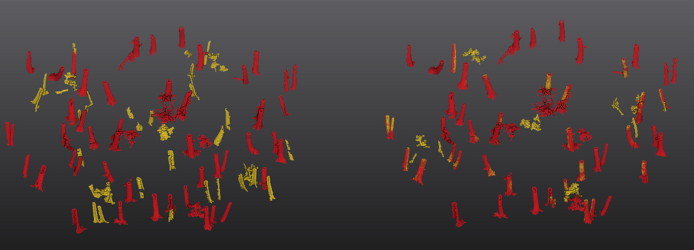

# lidRalignment


## Overview

`lidRalignment` is an extension package for `lidR` that enables automatic alignment of forest plot point clouds from different sources, such as ALS with TLS or MLS, or TLS with MLS. The package is robust to large alignment differences (e.g., 180 degrees of misalignment) and supports multiple feature extraction strategies to align airborne with ground data or ground with ground data.


**Figure 1** – The alignment of ALS (red) and MLS (yellow) point clouds is achieved by aligning the CHMs and DTMs, recording the transformation matrix, and applying it to the entire MLS point cloud.


**Figure 2** – The alignment of MLS (red) and TLS (yellow) point clouds is refined by extracting and aligning isotropic features (most likely the main trunks), recording the transformation matrix, and applying it to the entire TLS point cloud.

## Features

- Aligns forest plots from different sources, such as ALS with TLS or MLS, or TLS with MLS.
- Is robust to large alignment differences (e.g., 180 degrees of misalignment).
- Supports extremely noisy and poor-quality data.

## Installation

You need the latest version of `lidR` and `lasR`:  

```r
install.packages(c('lidR', 'lasR'), repos = 'https://r-lidar.r-universe.dev')
```

Then:

```r
remotes::install_github("r-lidar-lab/lidRalignment")
```

## Tutorial

The alignment pipeline consists of four stages, progressing from raw to extra fine:

1. **Raw:** Roughly aligns the plot centers.
2. **Coarse**: Uses the DTM and CHM to align the point clouds at low resolution. This stage can handle highly misaligned scenes.
3. **Fine**: Applies an iterative closest point (ICP) approach to finely align the CHM and DTM.
4. **Extra Fine**: Used only when aligning two ground-based point clouds. It extracts trees and aligns them to achieve centimeter-level accuracy.

```r
library(lidR)
library(lidRalignment)

fref = "als_file.las"
fmov = "mls_file.las"

# Setup the pipeline. It is important to tell the object
# what we are aligning in order to perform or not
# the last extra fine alignment
alignment = AlignmentScene$new(fref, fmov)
alignment$set_ref_is_ground_based(TRUE)
alignment$set_mov_is_ground_based(TRUE)

# Run the alignment pipeline
alignment$align()

# Visualize the different level of alignment
alignment$plot("raw")
alignment$plot("coarse")
alignment$plot("fine")
alignment$plot("extra", compare_to = "fine")

# Get the final transformation matrix to register the entire point cloud.
M = alignment$get_registration_matrix()

crs = sf::st_crs(readLASheader(fref))
ofile = transform_las(fmov, M, crs)
```

Rather than running the full alignment pipeline, it is possible to run it step by step.

```r
alignment = AlignmentScene$new(fref, fmov)
alignment$set_ref_is_ground_based(TRUE)
alignment$set_mov_is_ground_based(TRUE)

alignment$prepare()
alignment$plot("raw")

alignment$coarse_align()
alignment$plot("coarse")

alignment$fine_align()
alignment$plot("fine")

alignment$extra_fine_align()
alignment$plot("extra", compare_to = "fine")
```