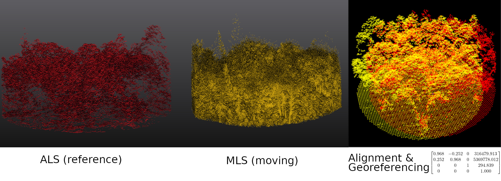

# lidRalignment


## Overview

`lidRalignment` is an extension package for `lidR` that enables automatic alignment of forest plot point clouds from different sources, such as ALS with TLS or MLS, or TLS with MLS. The package is robust to large alignment differences (e.g., 180 degrees of misalignment) and supports multiple feature extraction strategies to align airborne with ground data or ground with ground data.

It has been designed to align ALS, MLS, and TLS point clouds from plot inventories. The strategy is to align ALS with MLS and then MLS with TLS. ALS with TLS can work when the TLS is of good quality, but in practice, not all TLS point clouds have matching features with ALS.


**Figure 1** – The alignment of ALS (red) and MLS (yellow) point clouds is achieved by aligning the CHMs and DTMs, recording the transformation matrix, and applying it to the entire MLS point cloud.


**Figure 2** – The alignment of MLS (red) and TLS (yellow) point clouds is achieved by extracting and aligning isotropic features (most likely the main trunks), recording the transformation matrix, and applying it to the entire TLS point cloud.

## Features

- Aligns forest plots from different sources, such as ALS with TLS or MLS, or TLS with MLS.
- Is robust to large alignment differences (e.g., 180 degrees of misalignment).
- Supports several feature extraction strategies to align airborne with ground data or ground with ground data.
- Supports extremely noisy and poor-quality data.

## Installation

You need the latest version of `lidR` and `lasR`:  

```r
install.packages(c('lidR', 'lasR'), repos = 'https://r-lidar.r-universe.dev')
```

Then

```r
remotes::install_github("r-lidar-lab/lidRalignment")
```

The iterative closest point functions currently rely on [CloudCompare](https://www.danielgm.net/cc/). `CloudCompare` must be installed before using `lidRalignment`

## Tutorial

A generic pipeline that has been tested on multiple datasets is shipped with the package. Users can open it in `RStudio` with:

```r
rstudioapi::navigateToFile(system.file("", "pipeline.R", package="lidRalignment"))
```

The R script works as follows:

1. The user chooses two point clouds to align. These two point clouds can be in different coordinate systems, can be misaligned, and can be from different sources (e.g., ALS and TLS), but they **must** correspond to two plots (e.g., a 400 m² circular inventory),
and those two plots must share approximately the same center so that they overlap. One of the point clouds is the georeferenced reference (often the ALS), while the other point cloud will be moved and georeferenced by aligning it to the reference.
  ```r
  fref = "als_file.las"
  fmov = "mls_file.las"
  ```

2. Specify whether the point clouds are ALS or TLS/MLS (airborne vs. ground-based) so that the routine can pick the correct strategy.
Here, tls refers to ground-based, so it works for MLS as well.
  ```r
  ref_is_tls = FALSE
  mov_is_tls = TRUE
  ```

3. Define the path to `CloudCompare`. The default is `cc = find_cloudcompare()`. This may not work for you (it won't work on Linux and macOS)
  ```r
  cc = find_cloudcompare()
  ```

4. Run the following code block. The script will select the appropriate parameters depending on what the user is trying to align. The parameters can be changed, but they have been found to be robust across multiple datasets.

5. Run the code line by line, following the comments. The code will:
   - Read a fraction of the point clouds (there is no need to read 100% of the points).
   - Center the point clouds at (0,0,0).
   - Clip the point cloud with a radius of 20 m to ensure a clean clip without coarse sampling at the edge (important for MLS and TLS).
   - Classify and remove noise.
   - Classify ground points.
   - Extract alignable features using different strategies depending on the type of point clouds to align. It will either extract CHM and DTM or trees.
   - Perform a coarse registration to find potentially large misalignments of up to 180 degrees of error and several meters.
   - Perform a fine registration using an iterative closest point (ICP) approach made possible by the coarse registration.
   - Combine all the registration matrices.
   - Apply the final transformation to the entire point cloud.

